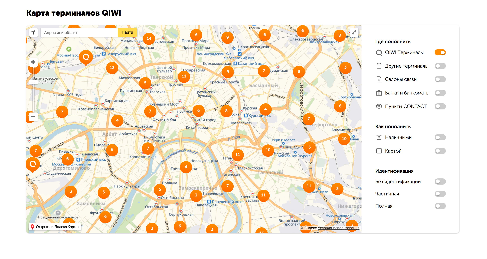

# JS приложение карты терминалов QIWI
Приложение позволяет установить месторасположение партнерских терминалов и терминалов QIWI.

### Сборка приложения 
~~~shell
git clone https://github.com/QIWI-API/qiwi-map.git
cd qiwi-map
npm install
npm run build
~~~

В результате сборки будет создан каталог `dist` со статическим содержимым приложения. 

## Запуск приложения
Приложение является набором статических файлов исполняемых на клиенте. 
Достаточно разместить содержимое каталога `dist` на сервере и добавить путь до файла `index.html` в этом каталоге.  

### Пример использования
~~~html
<iframe src="https://www.your-site.com/path-to-map-index" width="100%" height="795" style="border:none;"></iframe>
~~~

Можно посмотреть живой пример: 
- запустить сборку 
- открыть в браузере `examples/index.html`

### Для разработки 
~~~shell
npm install
npm start
~~~

## Документация
- [**API Карты терминалов QIWI**](https://developer.qiwi.com/qiwi-map/qiwi-map_ru.html): Описание API для установки местонахождения терминалов QIWI на территории РФ

## Лицензия
MIT
